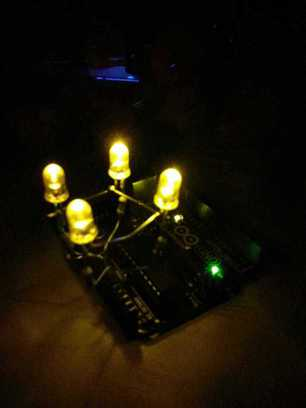
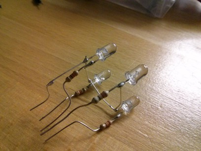
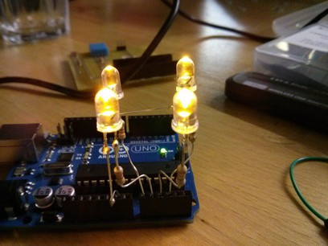

Arduino Advent wreath
=====================

What it is
----------

This is a small Advent wreath you can plug into your Arduino to get warm, fuzzy
feelings in the winter time.

How to build it
---------------

You need:

* 1 Arduino (I used an Arduino Uno)
* 4 LEDs
* 4 resistor (fitting your LEDs, I used 330 ohms)
* Some wire
* Solder equipment

1. Bend the cathodes of three LEDs 90 degrees and solder them together.
2. Shorten the anodes.
3. Join each anode with an resistor and solder them together.
4. Take some wire and lengthen the common cathode.
5. Bend the anodes (including resistors) and the cathodes in a way the LEDs are
arranged like the candles on an Advent wreath. The anodes should fit in the A0,
A1, A2 and A3 pins. The common cathode should fit into GND (obviously).
6. Put it all together.

Here are some pictures:

The Sketch
----------

In the `sketch` directory you find a sketch to let your candles flicker. After
flashing your Arduino only one candle will flicker. To let more candles flicker,
short pin 8 with GND and reset your Arduino. Now, every second one more candle
will be lit (they won't flicker though). Once all the candles you want are lit
remove the short between GND and pin 8 and soon the candles will begin to
flicker.

This sketch uses the [SoftPWM
library](http://code.google.com/p/rogue-code/wiki/SoftPWMLibraryDocumentation).
You'll have to install it in order to use this sketch.

Have fun.
